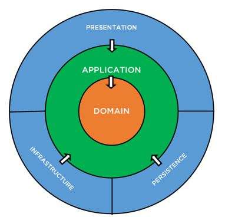
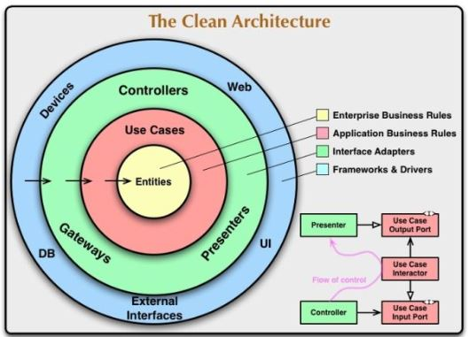

- [1. **Documento Arquitetural**](#1-documento-arquitetural)
  - [1.1. Introdução:](#11-introdução)
    - [1.1.1. Propósito do documento:](#111-propósito-do-documento)
    - [1.1.2. Escopo do documento:](#112-escopo-do-documento)
    - [1.1.3. Definições, acrônimos e abreviações:](#113-definições-acrônimos-e-abreviações)
  - [1.2. Representação Arquitetural:](#12-representação-arquitetural)
    - [1.2.1. Visão do caso de uso:](#121-visão-do-caso-de-uso)
    - [1.2.2. Visão lógica:](#122-visão-lógica)
      - [1.2.2.1. Padrão arquitetural:](#1221-padrão-arquitetural)
        - [1.2.2.1.1. Visão de camadas:](#12211-visão-de-camadas)
        - [1.2.2.1.2. Diagrama de pacotes:](#12212-diagrama-de-pacotes)
        - [1.2.2.1.3. Diagrama de classes:](#12213-diagrama-de-classes)
    - [1.2.3. Visão de dados:](#123-visão-de-dados)
      - [1.2.3.1. Modelo entidade-relacionamento:](#1231-modelo-entidade-relacionamento)
      - [1.2.3.2. Dicionário de dados:](#1232-dicionário-de-dados)
    - [1.2.4. Interfaces de integração:](#124-interfaces-de-integração)
  - [1.3. Implementação:](#13-implementação)
    - [1.3.1. Tecnologias:](#131-tecnologias)
    - [1.3.2. Recursos e ferramentas auxiliares:](#132-recursos-e-ferramentas-auxiliares)
  - [1.4. Plano de implantação:](#14-plano-de-implantação)
    - [1.4.1. Servidor:](#141-servidor)
    - [1.4.2. Recursos mínimos de máquina:](#142-recursos-mínimos-de-máquina)
    - [1.4.3. Banco de dados:](#143-banco-de-dados)
    - [1.4.4. Script de criação dos objetos de banco de dados:](#144-script-de-criação-dos-objetos-de-banco-de-dados)
    - [1.4.5. Procedimento de implantação:](#145-procedimento-de-implantação)
    - [1.4.6. Recursos e ferramentas auxiliares:](#146-recursos-e-ferramentas-auxiliares)
- [2. **Repositório de recursos**:](#2-repositório-de-recursos)

***
# 1. **Documento Arquitetural**
## 1.1. Introdução:
O propósito deste documento é apresentar a proposta arquitetural do projeto Portal Poupança Banpara, fornecendo uma visão geral de arquitetura abrangente do sistema de software. 
Sendo que nessa visão encontramos as principais decisões de projeto tomadas pela equipe de desenvolvimento e os critérios considerados durante a tomada destas decisões. Suas informações incluem a parte de hardware e software do sistema.
### 1.1.1. Propósito do documento:
Este documento tem como propósito estabelecer e apresentar as diretrizes a serem seguidas pelos desenvolvedores do projeto Portal Conta Poupança Banpará, bem como ser mais uma referência para discussão entre os responsáveis de todas as partes do projeto, servindo como um meio de comunicação entre o arquiteto de software e outros membros da equipe de projeto, com relação a decisões arquiteturais significativas tomadas sobre o projeto.
### 1.1.2. Escopo do documento:
Este documento descreve os diversos requisitos arquitetural como backend e frontend da aplicação, bem como procedimentos e diversos artefatos relacionados a aplicação.
### 1.1.3. Definições, acrônimos e abreviações:
Aqui são apresentadas as definições, acrônimos e abreviações utilizados ao longo do documento.

| IDE           | Ambiente integrada para desenvolvimento de softwares                                                  |
|---------------|-------------------------------------------------------------------------------------------------------|
| Git           | Ferramenta para armazenamento e controle de versão do código fonte.                                   |
| EF Core       | Entity framework Core – Mapeamento de tabelas em entidades                                            |                                                         
| WebApi        | .Net API for RESTful Web services                                                                     |                                
| JSON          | JavaScript Object Notation                                                                            |
| DI            | Dependency Injection                                                                                  |
| REST          | Representational State Transfer                                                                       |
| Cross-Cutting | Camada de arquitetura onde estão disponíveis funcionalidades comuns às demais cadamadas da aplicação. |
| UI            | User Interface – Interface com o usuário/camada de apresentação.                                      |
| ReactJs       | Framework para desenvolvimento frontend.                                                              |
| SGA           | Sistema de segurança (autenticação, autorização e auditoria) do Banpara.                              |
| SSRS          | SQL Server Reporting Services                                                                         | 

## 1.2. Representação Arquitetural:
### 1.2.1. Visão do caso de uso:
O diagrama abaixo representa a de forma simplificada a arquitetura do projeto.
Nessa abordagem nenhuma camada interna conhece ou tem acesso as camadas externas de forma que quanto mais interno mais independente e desacoplado se torna a camada.
Para uma camada interna conseguir usar algo de uma camada externa só é possível através de implementação de interfaces e do padrão de projeto de injeção de dependência. 

### 1.2.2. Visão lógica:
#### 1.2.2.1. Padrão arquitetural:
A arquitetura do projeto Portal Conta Poupança Banpara foi baseada no padrão de “Clean Architecture” o que prega pelo desacoplamento das camadas e algumas práticas para melhor interação entre essas camadas, de tal forma, que permita isolar todo o domínio do resto do sistema bem como suas regras de negócio. O padrão cliente-servidor separa as responsabilidades de UI e navegação (frontend) das regras de negócio (backend).

O projeto usa uma solução monorepositório onde todos os projetos ficam em um mesmo repositório, e está dividido em 2 principais camadas, contemplando:

- backend (.Net Core WebApi) - servidor;
- frontend (ReactJs – HTML/Javascript) - cliente;
  
  
Imagem Padrão arquitetural
Fonte: https://imasters.com.br/back-end/introducao-clean-architecture
##### 1.2.2.1.1. Visão de camadas:
Camada de apresentação (Presentation) (frontend)
A camada de apresentação é responsável pela apresentação visual, controle de navegação e pela interação do usuário com os serviços remotos (backend) da aplicação.

O frontend da aplicação é destinado ao consumo em navegadores Web, sendo constituído de HTML, CSS, JavaScript e imagens.

Tecnologias: HTML, CSS, ReacJs, Javascript.

Interface REST

Na camada de apresentação temos a API REST que é responsável por expor as interfaces das funcionalidades da aplicação para o mundo exterior, no caso específico, para a aplicação de frontend (também na camada de apresentação). Ela faz a ponte entre a camada de apresentação e a camada de aplicação.

Os serviços são expostos através de URLs, seguindo o padrão RESTful, para acesso via protocolo HTTP(S).

Tecnologias: AspNet WebApi.

Camada de Aplicação (Application)
Abriga os serviços que implementam as regras de negócio e outras funcionalidades adicionais, que se façam necessárias para o desenvolvimento e funcionamento da aplicação.

Toda a camada de aplicação está organizada em dois tipos de classes os Commands e as Querys, onde cada classe tem uma única responsabilidade. Os commands são usados para funcionalidades que alteram o estado do sistema de alguma forma, e as queries são utilizados para funcionalidades que apenas consultam informações. Dessa forma fica bem separado as responsabilidades e bem visível para os desenvolvedores.

Tecnologias: EF, MediatR, AutoMapper, DI.
Camada de Domínio (Domain)
Essa Camada é onde fica as entidades do sistema, nessa camada existem também métodos que são extremamente pertinentes ao negócio, essa sofre alterações com menos frequencia.

Tecnologias: .Net C#.
Camada de persistência
A camada de persistência, com o uso de EF, faz a interface entre o mundo orientado a objeto e o mundo do banco de dados relacional.

Tecnologias: .Net, EF.
Camada de infraestrutura
A camada de infraestrutura é responsável por implementar todas funcionalidades que não são pertinentes nem exclusiva do negócio do projeto, isolando assim e desacoplando as camadas internas para cuidarem apenas do negócio. Essa camada é responsável como por exemplo a comunicação de envio de email, log etc.
##### Diagrama de pacotes
Não há pacotes.
##### Diagrama de classes
A Organização das classes do Projeto Portal POUPANÇA (frontend) podem ser verificadas abaixo:
|Pasta|Descrição|
|-|-|
|Poupanca.WebUI/ClientApp|Pasta raiz. Contém as classes de configuração de build e deploy do projeto ReactJs|
|Src|Pasta que contem os fontes do frontend|
|components|Contém os componentes classes React que são reutilizados, componentes gerais|
|hooks|Contém as bibliotecas que facilitam a implementação e disponibilizam funcionalidades para os outros componentes e classes|
|pages|Contém todos os componentes que são as telas do sistema|
|providers|Contém bibliotecas padrões para interação com o usuário como controle de dialogs etc|
|services|Contém as bibliotecas que as telas usam para comunicar com a API do backend|
|styles|Contém arquivos de estilo css, scss etc|
|utils|Contém bibliotecas javascripts com funções auxiliares|
|Poupanca.WebUI/Controlers|Pasta com todos os fontes de todos os controllers da API REST|

A Organização das classes do Projeto Portal POUPANÇA (backend) podem ser verificadas abaixo:

|Pasta|Descrição|
|-|-|
|Core/Poupanca.Aplicacao|Pasta raiz que contém os códigos fontes de todos os commands e queries responsáveis pelo negócio e acesso as entidades do domínio|
|Infraestrutura|Nesta pasta estão localizadas todas as interfaces que permitem acesso a essa camada. São as interfaces que permitem que uma camada de fora consiga ser usada na aplicação. Bem como excepions, interfaces, behaviors, atributos etc| 
|Methods|Nesta pasta estão localizados os métodos de extensão das entidades, esses métodos que são utilizados por adicionar novas funcionalidades as entidades como pro exemplo concluir uma fase de uma proposta|
|Core/Poupanca.Dominio|Pasta raiz que contém todas as classes das entidades que mapeam o domínio do sistema|
|Entidades|Nesta pasta ficam todas entidades|
|Enumeradores|Nesta pasta ficam todas enumeradores|
|Infraestrutura/Poupanca.Infraestrutura|Nesta pasta estão todos os arquivos responsáveis por fazer configurar e disponibilizar serviços e funcionalidades externas como usuário logado, serviço de e-mail etc|
|Infraestrutura/Poupanca.Persistencia|Nesta pasta estão todos os arquivos responsáveis por fazer o mapeamento das entidades com as tabelas do banco de dados, também prove os meios para acessar essas tabelas|

### 1.2.3. Visão de dados:
#### 1.2.3.1. Modelo entidade-relacionamento:
Conforme Dicionário de dados.
#### 1.2.3.2. Dicionário de dados:
Conforme Dicionário de dados.

### 1.2.4. Interfaces de integração:

As interfaces de integração podem ser observadas no diagrama a baixo:

{height="400px" width="400px"}

## 1.3. Implementação:
### 1.3.1. Tecnologias:
As tecnologias utilizada para execução do sistema podem ser vistas a baixo.

| Nome               | Versão  | Descrição                                                                     |
|--------------------|---------|--------------------------------------------------------------------------------|
| Visual Studio Code | 1.19.1+ | Ambiente de desenvolvimento integrado (IDE) composto por um editor e plugins.  |
| Nome               | Versão  | Descrição                                                                      |
| Visual Studio      | 2019    | Ambiente de desenvolvimento integrado (IDE), composto por um editor e plugins. |
| Nome               | Versão  | Descrição                                                                      |
| Visual Studio      | 2019    | Adicionar ao Visual Studio a extensão para Reporting Services.                 |

### 1.3.2. Recursos e ferramentas auxiliares:

Outros recursos utilizados são tecnologias como HTML, CSS, ReacJs, Javascript, java e Spring Boot WebApi

## 1.4. Plano de implantação:
### 1.4.1. Servidor:

O servidor de Aplicação utilizado é OS: Windows Server 2012 R2 ou superior

### 1.4.2. Recursos mínimos de máquina:

Para a execução do sistema os servidores deverão ter Memória de 8GB de RAM. Onde o Processador é um Intel i3 (quad core) 3.6 Ghz e tem HD com pelo menos 10 GB de espaço livre para instalação.

### 1.4.3. Banco de dados:

A tecnologia de banco de dados é Banco de Dados SQL Server 2016+.

### 1.4.4. Script de criação dos objetos de banco de dados:
Item em pendência.

### 1.4.5. Procedimento de implantação:

O procedimento de implantação do sistema inicia com a construção da aplicação Sistema Portal Conta Poupança 
através da fábrica PDcase, posteriormente, a fábrica instala a aplicação no servidor em produção do Banpará. 
A fábrica permanece acompanhando por dois meses a aplicação. Após término desse prazo de acompanhamento, 
a equipe de sustentação da Pdcase assume a administração da aplicação no servidor de produção do banco, mantendo a manutenção do sistema.

### 1.4.6. Recursos e ferramentas auxiliares:
– Segurança
Será utilizado o SGA como sistema para gerenciamento de segurança, no que diz respeito a autenticação, autorização e auditoria.

# 2. **Repositório de recursos**:
Item em pendência.