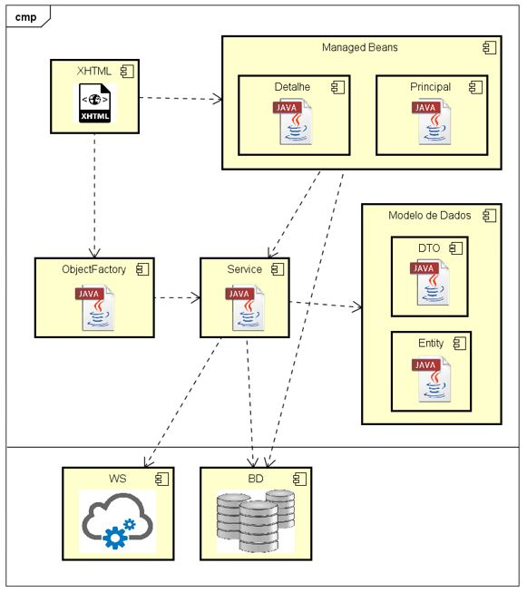
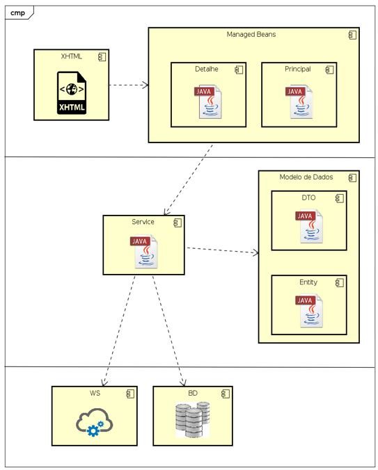
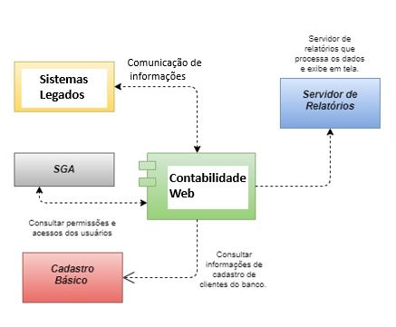

- [1. **Documento Arquitetural**](#1-documento-arquitetural Contabilidade Web)
  - [1.1. Introdução:](#11-introdução)
    - [1.1.1. Propósito do documento:](#111-propósito-do-documento)
    - [1.1.2. Escopo do documento:](#112-escopo-do-documento)
    - [1.1.3. Definições, acrônimos e abreviações:](#113-definições-acrônimos-e-abreviações)
  - [1.2. Representação Arquitetural:](#12-representação-arquitetural)
    - [1.2.1. Visão do caso de uso:](#121-visão-do-caso-de-uso)
    - [1.2.2. Visão lógica:](#122-visão-lógica)
      - [1.2.2.1. Padrão arquitetural:](#1221-padrão-arquitetural)
        - [1.2.2.1.1. Visão de camadas:](#12211-visão-de-camadas)
        - [1.2.2.1.2. Diagrama de pacotes:](#12212-diagrama-de-pacotes)
        - [1.2.2.1.3. Diagrama de classes:](#12213-diagrama-de-classes)
    - [1.2.3. Visão de dados:](#123-visão-de-dados)
      - [1.2.3.1. Modelo entidade-relacionamento:](#1231-modelo-entidade-relacionamento)
      - [1.2.3.2. Dicionário de dados:](#1232-dicionário-de-dados)
    - [1.2.4. Interfaces de integração:](#124-interfaces-de-integração)
  - [1.3. Implementação:](#13-implementação)
    - [1.3.1. Tecnologias:](#131-tecnologias)
    - [1.3.2. Recursos e ferramentas auxiliares:](#132-recursos-e-ferramentas-auxiliares)
  - [1.4. Plano de implantação:](#14-plano-de-implantação)
    - [1.4.1. Servidor:](#141-servidor)
    - [1.4.2. Recursos mínimos de máquina:](#142-recursos-mínimos-de-máquina)
    - [1.4.3. Banco de dados:](#143-banco-de-dados)
    - [1.4.4. Script de criação dos objetos de banco de dados:](#144-script-de-criação-dos-objetos-de-banco-de-dados)
    - [1.4.5. Procedimento de implantação:](#145-procedimento-de-implantação)
    - [1.4.6. Recursos e ferramentas auxiliares:](#146-recursos-e-ferramentas-auxiliares)
- [2. **Repositório de recursos**:](#2-repositório-de-recursos)

***
# 1. **Documento Arquitetural**
## 1.1. Introdução:
O propósito deste documento é apresentar a proposta arquitetural da aplicação Contabilidade Web do projeto Portal Contabilidade Banpará, fornecendo uma visão geral de arquitetura abrangente do sistema de software. 
Sendo que nessa visão encontramos as principais decisões de projeto tomadas pela equipe de desenvolvimento e os critérios considerados durante a tomada destas decisões. Suas informações incluem a parte de hardware e software do sistema.
### 1.1.1. Propósito do documento:
Este documento tem como propósito estabelecer e apresentar as diretrizes a serem seguidas pelos desenvolvedores da aplicação Contabilidade Web do projeto Portal Contabilidade Banpará, bem como ser mais uma referência para discussão entre os responsáveis de todas as partes do projeto, servindo como um meio de comunicação entre o arquiteto de software e outros membros da equipe de projeto, com relação a decisões arquiteturalmente significativas tomadas sobre o projeto.
### 1.1.2. Escopo do documento:
O escopo deste documento descreve os diversos requisitos arquitetural como backend e frontend da aplicação, bem como procedimentos de acesso ao sistemas.
### 1.1.3. Definições, acrônimos e abreviações:
Aqui são apresentadas as definições, acrônimos e abreviações utilizados ao longo do documento.

|     Denominações       |     Definições, acrônimos e abreviações                                             |
|---------------|-------------------------------------------------------------------------------------------------------|
|     IDE       | Ambiente integrada para desenvolvimento de softwares                                |
|   JSF/facelets            |   Linguagem de declaração da visão para a tecnologia JavaServer Faces                     |
|      DTO         |      Data Transfer Object (DTO)  Transfer Object é um padrão de projetos usado em Java para o transporte de dado|
|     JPA      |   Camada de Persistência Java - Camada que descreve uma interface comum para frameworks ORM |
|   Clean Architecture          |   Padrão arquitetural que preza por desacoplamento das camadas de um software|
|     JDK     |   Kit de Desenvolvimento Java - É uma implementação do Java Virtual Machine* que na verdade executa programas Java|                                                               
|     ManagedBean    |      Implementação de uma classe Java, que é chamada de classe Bean ligadas ao framework spring|
|    Factorys       |    Padrão de design é usado quando tem uma superclasse com várias subclasses e com base na entrada, precisamos retornar uma das subclasses|
|     POJOs      |       Referencia a objetos que não dependem da herança de interfaces ou classes de frameworks externo| 

____

## 1.2. Representação Arquitetural:
A aplicação Contabilidade Web do Banpará foi baseada no padrão da arquitetura do framework Spring Java. 

### 1.2.1. Visão do caso de uso:
O Spring é um framework Java criado com o objetivo de facilitar o desenvolvimento de aplicações, explorando, para isso, os conceitos de Inversão de Controle e Injeção de Dependências. 
Dessa forma, ao adotá-lo, temos à nossa disposição uma tecnologia que nos fornece recursos necessários à grande parte das aplicações, 
como módulos para persistência de dados, integração, segurança, testes, desenvolvimento web.

### 1.2.2. Visão lógica:
#### 1.2.2.1. Padrão arquitetural:

Desta forma o padrão arquitetural é baseado em interfaces e POJOs (Plain Old Java Objects), oferecendo aos POJOs características como mecanismos de segurança e controle de transações e apresentação. 
  
##### 1.2.2.1.1. Visão de camadas:

No Java não há camadas separadas como no padrão Clean Architecture. Há modulos responsáveis pelo Domínio de dados, persistencia de dados, bem como a apresentação.  
Na imagem abaixo é demonstrado o cenário atual de desenvolvimento utilizando o Framework Java Spring na qual a aplicação foi denominada Orion, contendo seus componentes de desenvolvimento, a saber:
	XHTML: páginas de visualização JSF/facelets;
	Managed Beans;
	Principal: ManagedBean de entrada das transações contendo a página de filtro do CRUD.
	Detalhe: Managed Bean que controla as funções da barra de função.
	ObjectFactory: contém os Factorys das listas das telas com seus respectivos escopos;
	Service: contém as transações do sistema, montam os objetos e se comunicam entre sí. 
	DTO: objeto de transferência de dados e somente isso.
	Entity: entidade JPA que é um mapeamento de uma tabela do banco de dados.
 

Na próxima imagem é demonstrado o cenário atual de desenvolvimento utilizando o Framework Summer produzido via java Spring, contendo seus componentes de desenvolvimento, a saber:
	XHTML: páginas de visualização JSF/facelets;
	Managed Beans;
	AbstractListMB: Managed Bean de entrada das transações contendo a página de filtro do CRUD.
	AbstractDetailMB: Managed Bean controla a visualização e a edição dos beans.
	Service: contém as transações do sistema, montam os objetos e se comunicam entre sí.;
	DTO: objeto de transferência de dados e somente isso.
	AbstractEntity: entidade JPA que é um mapeamento de uma tabela do banco de dados.
 

##### 1.2.2.1.2. Diagrama de pacotes:
 
Item em pendência.

##### 1.2.2.1.3. Diagrama de classes:
Item em pendência.
### 1.2.3. Visão de dados:
#### 1.2.3.1. Modelo entidade-relacionamento:
Conforme Dicionário de dados.
#### 1.2.3.2. Dicionário de dados:
Conforme Dicionário de dados.
### 1.2.4. Interfaces de integração:

As interfaces de integração podem ser observadas no diagrama a baixo:

{height="400px" width="400px"}

## 1.3. Implementação:
### 1.3.1. Tecnologias:
As tecnologias utilizada para execução do sistema:

• Sistema Operacional: Windows 7 ou superior
• JAVA  jdk1.6.0_31
• IDE Eclipse ou qualquer IDE com suporte a java

### 1.3.2. Recursos e ferramentas auxiliares:

Outros recursos utilizados são tecnologias como HTML, CSS, Javascript. 

## 1.4. Plano de implantação:
### 1.4.1. Servidor:

• Servidor de Aplicação utilizado: Windows Server 2008, Windows Server 2008 R2
•  Web Server /Application Server /Conteiner IIS Versão: 7.0

### 1.4.2. Recursos mínimos de máquina:

Requisitos de Hardware:

• Processador: Intel Pentium Core i5 ou superior
• Memória Principal: Mínimo 6GB de RAM ou superior
• Disco Rígido: Espaço livre mínimo de 300 GB
• Placa de Rede: 10/100 Mbits, equivalente ou superior

### 1.4.3. Banco de dados:

A tecnologia de banco de dados é Banco de Dados SQL SERVER Versão:2016 com SGBD SQL SERVER 2008 ou superior

### 1.4.4. Script de criação dos objetos de banco de dados:
Item em pendência
### 1.4.5. Procedimento de implantação:

O procedimento de implantação do sistema inicia com a construção da aplicação Sistema Portal Conta Contabilidade 
através da fábrica PDcase, posteriormente, a fábrica instala a aplicação no servidor em produção do Banpará. 
A fábrica permanece acompanhando por dois meses a aplicação. Após término desse prazo de acompanhamento, 
a equipe de sustentação da Pdcase assume a administração da aplicação no servidor de produção do banco, mantendo a manutenção do sistema.

### 1.4.6. Recursos e ferramentas auxiliares:
CONFIGURAÇÃO MÍNIMA DO SERVIDOR DE APLICAÇÃO DESENVOLVIMENTO (BANPARA):

• CPU AMD Opteron 2.3Ghz ou superior

• Memória RAM 16 Gb ou superior

• Espaço em disco 50Gb ou superior
# 2. **Repositório de recursos**:
Item em pendência.